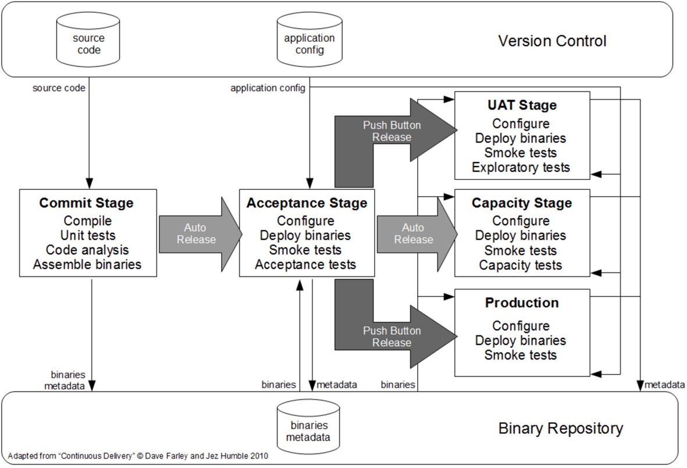

# Testowanie wydajności w projekcie

Ostatnie lata przyniosły zmiany w sposobie rozwijania aplikacji. Przeszliśmy od kaskadowych projektów budujących aplikacje monolityczne do zwinnego tworzenia aplikacji opartych o mikroserwisy. Olbrzymie zmiany zaszły również w wykorzystywanych technologiach. Odpowiednio musimy zatem dostosować nasze podejście do testowania wydajności.

## Wydajność w testowaniu zmian 

Testując działanie nowego komponentu lub jego modyfikację, skupiamy się na aspektach funkcjonalnych. Warto jednak wzbogacić testy o weryfikacje związane z wydajnością. Nie jest to znaczny wzrost czasu i kosztów, ponieważ większość narzędzi do testów funkcjonalnych pokazuje czas odpowiedzi, a także umożliwia wykonanie zapytań w pętli i kilku wątkach. Wykorzystując te możliwości, możesz szybko sprawdzić, czy:

- czas odpowiedzi przy pojedynczych zapytaniach mieści się w granicach wymagań,
- zwiększenie ilości danych wpływa znacząco na czas odpowiedzi, jeśli tak, to może mieć wpływ w warunkach produkcyjnych,
- serwis działa stabilnie przez przynajmniej 1 godzinę, najlepiej przy równoległym obciążeniu.

Warto dodać powyższe punkty do list kontrolnych (ang. check list) dla zadań testerskich lub jako część Definition of Done.

Ważnym aspektem na tym etapie prac jest mockowanie serwisów zewnętrznych. Jest tak z kilku powodów:

- łatwiej zadbać o odpowiednie dane testowe,
- łatwiej zadbać o stabilność,
- często serwisy zewnętrzne są również w budowie i mogą być jeszcze niedostępne.

Możemy do tego wykorzystać wiele rozwiązań, które są dostępne dla większości języków programowania. Korzystanie z części z nich nie wymaga nawet posiadania umiejętności programowania.

Dzięki wcześnie sprawdzonym aspektom związanym z wydajnością, zespół będzie mógł szybko zaadresować problemy.

> "System sprzedaży biletów działał płynnie dla wydarzeń dla kilkuset uczestników jakie były testowane funkcjonalnie. W przypadku wydarzeń organizowanych dla kilku tysięcy uczestników, problemy wydajnościowe były widoczne już przy pojedynczych zapytaniach. Problemy nie zostały wykryte. Niestety były na tyle poważne, że wymagały zmiany architektury aplikacji."

Sprawdzenie wydajności serwisu w izolacji daje nam szybką informacje zwrotną i jest warunkiem wymaganym do poprawnego działania systemu po integracji. Nie daje nam to jednak pewności, że tak będzie i musimy to dodatkowo sprawdzić.

## Ciągłe testowanie wydajności

Ciągłe testowanie (ang. continuous testing) to podejście, w którym automatycznie testujemy zmiany, tak wcześnie jak tylko jest to możliwe. Dotyczy to również automatycznego testowania wydajności. Referencyjny model testowania został zaprezentowany w książce Continuous Delivery i zamieszczam go poniżej.
 

Chcąc w ten sposób zorganizować testy wydajności będziemy potrzebować dedykowanego środowiska, na które okresowo będzie wdrażana grupa mikroserwisów bądź też cały system. Nowe wersje komponentów instalujemy i testujemy okresowo ponieważ testy wydajnościowe mogą trwać kilka godzin. Możemy chcieć przecież sprawdzić nie tylko szybkość ale i stabilność systemu. Praktycznie zatem trudno byłoby testować każdą zmianę. 

Środowisko na jakim testujemy nie musi być tak rozbudowane jak nasza produkcja. Dysponując pomiarami z poprzedniego wykonania testów (pomiarami referencyjnymi) będziemy mogli sprawdzać czy nie pogorszyły sie one dla aktualnie testowanej wersja. Jest to wystarczające pod warunkiem, że nowe funkcjonalności wdrażamy na produkcję stopniowo i dzięki odpowiedniemu monitoringowi możemy w porę wykryć problemy związane z niewystarczającymi możliwościami systemu.   

W ramach testów należy sprawdzić główne scenariusze wykorzystania systemu przez użytkownika końcowego. Niezbędna zatem jest odpowiednio częsta ich aktualizacja.  

W zamian za to, że testy wykonujemy często i są one stopniowo dostosowywane do jego nowych funkcji systemu łatwo możemy oszacować związany z nimi nakład pracy. W przypadku pojawiania się problemów szybko wykryjemy jaka zmiana w kodzie lub infrastrukturze je spowodowała. Szybko również będziemy mogli wdrożyć i zweryfikować poprawki.

## Testowanie przed wdrożeniem dużych zmian

Jeśli nie chcemy lub nie możemy testować wydajności w sposób opisany powyżej, warto testy wydajnościowe wykonać przynajmniej przed wdrożeniem dużych zmian. Zwykle w tym przypadku nie mamy wyników referencyjnych, więc testy muszą być wykonane na środowisku możliwie bliskim do środowiska produkcyjnego. Przygotowanie takiego środowiska jest często dużym wyzwaniem. W tym podejściu chcemy też zasymulować produkcyjne obciążenie, zatem narzędzia symulujące obciążenie muszą być odpowiednio wydajne.

Przygotowanie środowiska i skryptów wymaga odpowiedniej ilości czasu, co oddala moment wdrożenia aplikacji dla klientów. Równie trudno oszacować czas potrzebny na diagnozę i poprawę wykrytych problemów.

## Testowanie na produkcji

Zdarza się również, że nie dysponujemy środowiskiem testowym o wydajności podobnej do produkcji. W takim przypadku pozostaje nam wykonać testy na środowisku produkcyjnym. Wdrożenie zmian planujemy na tyle długo przed okresem dużego obciążenia (np. Black Friday) aby mieć czas na wykonanie testów i prowadzenie poprawek. Musimy w znacznie większą dokładnością zadbać o:

- brak wpływu testów na systemy zintegrowane (np. systemy księgowe, rozsyłanie email i powiadomień)
- przygotwanie odpowiednich danych do testów (np. dedykowane produkty do testów)
- przygotowanie infrastruktury (np. wyłączenie zabezpieczeń DDoS, przeplanowanie nocynych backupów)

Testy wykonujemy w nocy gdy system nie jest wykorzystywany przez rzeczywistych klientów.

Podejście to niesie ze sobą ryzyko, że nie uda nam się w porę naprawić problemów. Mimo to lepiej o problemach wydajnościowych się wcześniej i być może przygotować plan awaryjny. 

## Jednostkowe testy wydajności

W szczególnych przypadkach możemy weryfikować szybkość działania klas i ich funkcji w ramach testów jednostkowych. Dla większość języków programowania powinniśmy znaleźć tego typu narzędzia. Wykorzystuje się je głównie tworząc biblioteki. Bazując na doświadczeniach sugeruję jednak aby tego typu testy planować tylko jeśli kod zawiera złożone algorytmy obliczeniowe, które zespół sam zaimplementował. W innych przypadkach nie przyniesie to oczekiwanych korzyści. 

## Zadania

- Zastanów się jakie podejście chcesz zastosować w swoim projekcie.

### Dodatkowe materiały

- [Automating safe, hands-off deployments](https://aws.amazon.com/builders-library/automating-safe-hands-off-deployments)