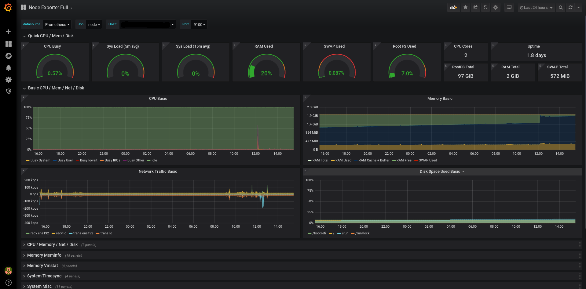

# Monitorowanie systemu i infrastruktury

Przy diagnozowaniu przyczyn niewystarczającej wydajności systemu często konieczne jest śledzienie parametrów pracy systemu oraz wykorzystanie zasobów sprzętowych. Warto poznać podstawowe narzędzia opisanych w artykule [Extreme-Linux-Performance-Monitoring-and-Tuning](./monitoring/Extreme-Linux-Performance-Monitoring-and-Tuning-uuasc-june-2006.pdf) ale wraz ze wzrostem złożoności systemu korzystanie z nich może być nieefektywne. Musimy sięgnąć po narzędzia, które pozwolą zebrać dane z wielu źródeł, zprezentują je w czytelny sposób a może nawet automatycznie wykryją anomalie i podpowiedzą rozwiązanie. 

## Stos technologiczny PLG
Jednym z wiodących rozwiązań w zakresie monitorowania i analizy systemu są narzędzia rozwijane przez Grafana Labs. W kontekście narzędzi oferowanych przez tego dostawę, często używa się skrótu PLG stack, który odnosi się do trzech głównych narzędzi tego ekosystemu: Prometheus, Loki, Grafana. Z elementów tych zbydujemy zintegrowany ekosystemu, które pozwala na efektywne zbieranie, przechowywanie, analizowanie i wizualizowanie metryk oraz logów. Dzięki tym narzędziom, jako tester wydajności możesz łatwo monitorować stan systemu podczas i lepiej rozumieć wpływ różnego rodzaju obciążeń na jego działanie. Narzędzia te dostępne są w wersji Open Source do zainstalowania we własnej infrastrukturze oraz w wersji Cloud do wykorzystania jako płatna usługa.

```mermaid
graph TD;
    subgraph Testowany System
    Agent
    Promtail
    end
    Prometheus --> | zbiera metryki | Agent ; 
    Promtail -->| przesyła logi | Loki;
    Grafana --> | odpytuje o dane| Prometheus;
    Grafana --> | odpytuje o dane| Loki;
```
## Prometheus
[Prometheus](https://prometheus.io/docs/introduction/overview/) jest narzędziem zbierającym i przechowującym metryki. W odróżnieniu od bazy danych SQL jest zoptymalizowany do przechowywania serii danych czasowych (ang. time series metrics). Dzięki optymalizacji, przechowywane dane zajmują dużo mniej miejsca a złożone operacje na danych z bardzo długich okresów mogą wykonywać się dużo szybciej.  Integracja i zbieranie metryk z typowych komponentów systemu jest bardzo szybki i prosta za sprawą wielu dostępnych rozszerzeń. Programiści dysponują również bibliotekami umożliwiającymi zbieranie metryk z rozwijanych przez nich aplikacji.    

```yaml
# Przykład konfiguracji pobierającej dane z aplikacji node_exporter

global:
    scrape_interval: 15s

scrape_configs:
- job_name: node
    static_configs:
    - targets: ['localhost:9100']
```

Zbierane dane zapisywane są w postaci metryk zawierających danych opatrzone etykietami. Poniżej kilka przykładów jakie pomogą zrozumieć podstawy zarówno sposobu przechowywania danych jak i języka zapytań Prometheus'a.

Pobranie ostatnich wartości dla wszystkich serii metryki `node_cpu_seconds_total`.
```
node_cpu_seconds_total
```
Zwróci w wyniku przykładowe wartości
| Metryka                                                                               |Wartość|
|---------------------------------------------------------------------------------------|-------|
| node_cpu_seconds_total{cpu="0", instance="localhost:9100", job="node", mode="idle"}   | 19.41 |
| node_cpu_seconds_total{cpu="0", instance="localhost:9100", job="node", mode="iowait"} | 38.55 |
| node_cpu_seconds_total{cpu="0", instance="localhost:9100", job="node", mode="irq"}    | 0     |
| node_cpu_seconds_total{cpu="0", instance="localhost:9100", job="node", mode="nice"}   | 3.06  |
| node_cpu_seconds_total{cpu="0", instance="localhost:9100", job="node", mode="softirq"}| 0.05  |
| node_cpu_seconds_total{cpu="0", instance="localhost:9100", job="node", mode="steal"}  | 0.16  |
| node_cpu_seconds_total{cpu="0", instance="localhost:9100", job="node", mode="system"} | 7.62  |
| node_cpu_seconds_total{cpu="0", instance="localhost:9100", job="node", mode="user"}   | 31.46 |
| node_cpu_seconds_total{cpu="1", instance="localhost:9100", job="node", mode="idle"}   | 21.23 |
| node_cpu_seconds_total{cpu="1", instance="localhost:9100", job="node", mode="iowait"} | 41.95 |
| node_cpu_seconds_total{cpu="1", instance="localhost:9100", job="node", mode="irq"}    | 0     |
| node_cpu_seconds_total{cpu="1", instance="localhost:9100", job="node", mode="nice"}   | 4.59  |
| node_cpu_seconds_total{cpu="1", instance="localhost:9100", job="node", mode="softirq"}| 0.01  |
| node_cpu_seconds_total{cpu="1", instance="localhost:9100", job="node", mode="steal"}  | 0.03  |
| node_cpu_seconds_total{cpu="1", instance="localhost:9100", job="node", mode="system"} | 5.95  |
| node_cpu_seconds_total{cpu="1", instance="localhost:9100", job="node", mode="user"}   | 26.94 |

Pobranie ostatnich wartości dla metryki `node_cpu_seconds_total` oraz atrybutu mode=idle.
```
node_cpu_seconds_total{mode="idle"}
```
Pobranie zmiany wartości w ciągu ostatnich 5 minut.
```
rate(node_cpu_seconds_total{mode="idle"}[5m])
```

Pobranie średniej wartości zajętości procesora w czasie 5 minut
```
100 * (1 - avg(rate(node_cpu_seconds_total{mode="idle"}[5m])))
```

Więcej informacji znajdziesz w dokumentacji pod linkiem [Querying Prometheus](https://prometheus.io/docs/prometheus/latest/querying/basics/) 

## Loki & Promtails
Kolejnym narzędziem stosu jest [Loki](https://grafana.com/oss/loki/), który służy do agregowania i przetwarzania logów aplikacji. Podobnie jak w Prometheus do zbierania danych korzystamy z dodatkowych narzędzi. Najprostsze z nich to promtail, który przesyła logi z podajej lokalizacji na dysku do Loki.

```yaml
# Zbieranie logów z nginx
http_listen_port: 9080
grpc_listen_port: 0

positions:
  filename: /etc/promtail/positions.yaml

clients:
  - url: http://localhost:3100/loki/api/v1/push

scrape_configs:
- job_name: nginx
  static_configs:
  - targets:
      - localhost
    labels:
      job: nginx
      hostname: your-hostname
      __path__: /var/log/nginx/*.log
```

Przykładowe zapytania LogQL wyświetlające logi zawierające tekst "error" 
```
{job="nginx"} |= "error"
```
Zapytanie wyświetlające wpisy bazujęce na wyrażeniu regularnym
```
{job="nginx"} |~  `error=\w+`
```
Zapytania zawierające tekst error oraz nie zawierające tekstu timeout
```
{job="nginx"} |= "error" != "timeout"
```
Wyszukiwanie po tekście nie jest wygodne dlatego loki pozwala  w prosty sposób zdefiniować jakie dane występują w logach aby dalej się do nich odwoływać. 
```
83.30.46.250 - - [19/Oct/2024:11:40:37 +0000] "GET /ContactsWS/img/sjsi.png HTTP/1.1" 200 18173 "-" "Apache-HttpClient/4.5.14 (Java/17.0.6)" 0.001
183.32.40.2 - - [19/Oct/2024:11:40:31 +0000] "GET /ContactsWS/img/sjsi.png HTTP/1.1" 200 18173 "-" "Apache-HttpClient/4.5.14 (Java/17.0.6)" 0.002
83.30.46.250 - - [19/Oct/2024:11:40:24 +0000] "GET /ContactsWS/img/sjsi.png HTTP/1.1" 200 18173 "-" "Apache-HttpClient/4.5.14 (Java/17.0.6)" 0.001
```
Dla domyślnych ustawień logowania nginx możemy wykorzystać zapis poniżej aby odfiltrować zapytania z wybranego zakresu
```
{job="nginx"} | pattern `<ip> - - <_> "<method> <uri> <_>" <status> <size> "<_>" "<agent>" <duration>` | ip = "83.30.46.250"
```

Zapytanie zwracające liczbę wpisów w ostatnich 5 minutach
```
count_over_time({job="nginx"}[5m])
```


Więcej informacji znajdziesz pod linkiem [Querying Loki](https://grafana.com/docs/loki/latest/query/)

## Grafana
Niewątpliwie najbardziej popularnym narzędziem stosu PLG jest Grafana. Jest to aplikacja służąca do prezentowania danych. Źródłem danych mogą być pliki, dane z bazy SQL oraz oczywiście aplikacje takie jako Prometheus oraz Loki. W celu prezentacji danych, użytkownik ma dyspozycji ma wiele widgetów, z których może stworzyć interaktywne dashboardy. Do wizualizacji danych można skorzystać z wiele dostęnych szablonów. Możemy je znaleźć pod linkiem [Dashboards](https://grafana.com/grafana/dashboards/). Do korzystania z nich wystarczy skonfigurować odpowiednie źródło danych.

