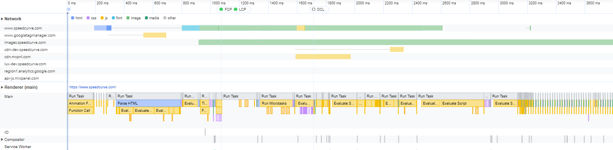
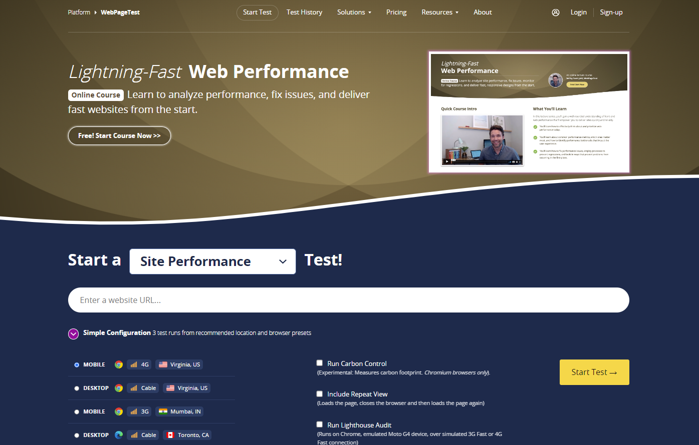
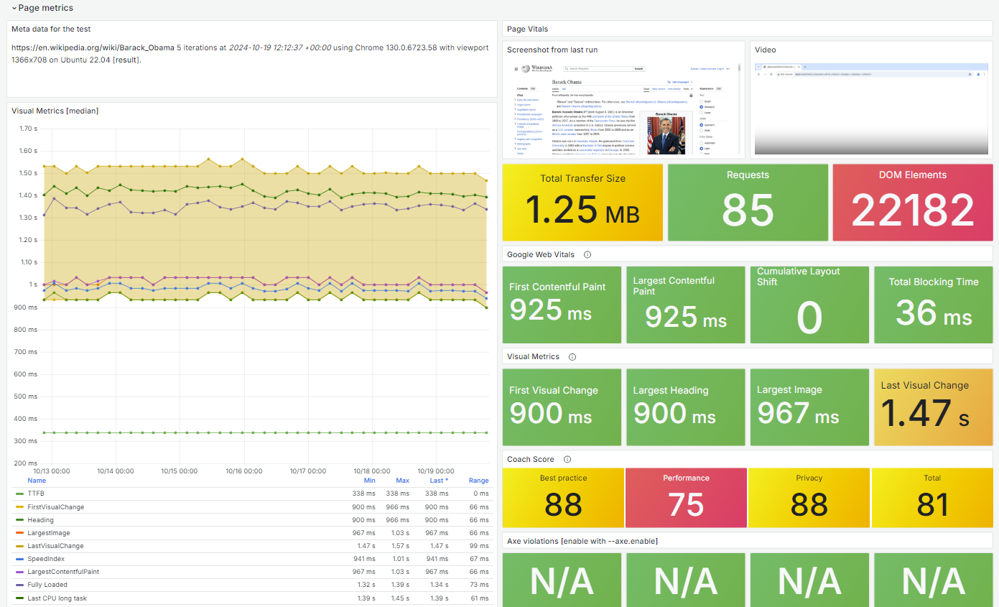

# Wydajność oczami użytkownika 
Narzędzia takie jak JMeter koncentrują się na mierzeniu czasu odpowiedzi serwera. Informacje te są bardzo ważne ale nie mierzą odczuć związanych z wyświetlaniem i stabilnością elementów strony oraz możliwości interakcji użytkownika z witryną. Różnice pomiędzy czasami raportowanymi w JMeter a tym co widzi użytkownik są duże z powodu rewolucji jaka zaszła w architekturze aplikacji web. Według danych [HTTP archive](https://httparchive.org/reports/state-of-the-web) z 2023 roku witryny web wykonują średnio 71 zapytań pobierając przy tym 2.3 Mb danych. Przy tak dużej złożoności czas wyświetlenia stron zależy nie tylko od czasu pobranie danych ale również od czasu wykonania kodu JavaScript oraz interpretacji plików CSS przez przeglądarkę.

Od czasów wydania książki "High Performance Websites" prowadzono wiele prac mających na celu pomiar szybkości działania aplikacji web i związanych z nią doświadczeń użytkowników. Przeglądatki wyposażono w wiele funkcji i API pozwalających precyzyjnie poznać proces wyświetlania treści. Powstały nowe narzędzia, zdefiniowano wiele metryk i prowadzono badania na temat ich wpływu na odczucia użytkowników. 

## Core Web Vitals
Metryki  [Core Web Vitals](https://web.dev/articles/vitals) stanowią ewolucję wcześniejszych prac. To zestaw trzech metryk, które pozwalają w łatwy sposób zrozumieć, jak dobrze witryna radzi sobie z szybkością, reaktywnością i stabilnością, a w konsekwencji, jak pozytywne jest doświadczenie użytkownika podczas przeglądania strony. 

Pierwszą z kluczowych metryk jest Largest Contentful Paint (LCP), która mierzy czas potrzebny do wyświetlenia największego elementu widocznego w oknie przeglądarki. Mierzenie czasu do największego elementu na stronie jest kluczowe, ponieważ to właśnie ten element ma największy wpływ na postrzeganą szybkość ładowania strony przez użytkownika. Największy element zwykle zawiera najważniejsze informacje, takie jak główny obraz lub nagłówek, które są istotne dla zrozumienia zawartości strony. Im szybciej ten element jest widoczny, tym szybciej użytkownik przykuwa swoją uwagę do treści, co zwiększa zadowolenie z korzystania ze strony. Elementem tym może być obraz, wideo lub duży blok tekstu. Aby zapewnić pozytywne doświadczenie użytkownika, LCP powinien wynosić poniżej 2,5 sekundy.

Dane dotyczące użycia przeglądarki Chrome pokazują, że 90% czasu spędzanego przez użytkownika na stronie przypada na okres po jej załadowaniu. Dlatego dokładny pomiar responsywności przez cały cykl życia strony jest ważny. Właśnie to mierzy kolejna kluczowa metryka Interaction to Next Paint (INP). Dokładniej INP mierzy czas, jaki upływa od momentu interakcji użytkownika z witryną (np. kliknięcia, dotknięcia ekranu) do momentu, w którym przeglądarka jest w stanie zareagować i wyświetlić następną kluczową klatkę wizualną. Pomiary dokonywane są w czasie całego pobytu użytkownika na stronie a wynik to czas najdłuższej interakcji. Dla zapewnienia pozytywnego doświadczenia użytkownika, INP powinien być jak najkrótszy, najlepiej poniżej 200 ms.

Ostatnią kluczową metryką jest Cumulative Layout Shift (CLS), która mierzy, jak często użytkownicy doświadczają niespodziewanych przesunięć elementów wizualnych na stronie. Przykładem takich przesunięć mogą być reklamy, które pojawiają się nagle i zmieniają układ strony, lub obrazy, które ładują się bez odpowiednich wymiarów. Aby zapewnić stabilność wizualną, CLS powinien wynosić poniżej 0,1.

Statystyki pokazują, że strony z lepszymi wynikami Core Web Vitals mają niższy współczynnik odrzuceń i wyższy współczynnik konwersji. Badania Google wykazały, że strony osiągające docelowe wartości LCP, FID i CLS mają o 24% niższy współczynnik odrzuceń w porównaniu do stron, które nie spełniają tych kryteriów. Poprawa Core Web Vitals może więc bezpośrednio wpływać na sukces biznesowy witryny. 

Core Web Vitals stały się również jednym z kluczowych czynników rankingowych. Google wyraźnie zaznacza, że strony oferujące lepsze doświadczenie użytkownika poprzez wysokie wyniki CWV będą miały przewagę w wynikach wyszukiwania, co czyni te metryki nieodzownym elementem strategii SEO. 

Dla testerów Core Web Vitals powinny być dodatkowym elementem weryfikowanym w czasie testów, szczególnie gdy badamy wpływ obciążenia na szybkość i stabilność działania aplikacji web.

## Jak mierzyć Core Web Vitals?
Do pomiaru metryk Core Web Vitals na środowisku testowym najprościej wykorzystać zakładkę [Performance](https://developer.chrome.com/blog/devtools-realtime-cwv) w Chrome DevTools. Prezentuaje ona wyniki pomiarów dla aktualnie prezentowanej strony. Jeśli chcemy zebrać nieco więcej informacji, zasymulowąć różne warunki wyświetlania strony a także otrzymać wskazówki co do poprawy jej wydajności należy przejść do zakładki Lighthouse i wykonać audyt strony. 

Warto wykonać kilka pomiarów i na podstawie zebranych wyników ocenić stabilność naszego środowiska testowego. Informacje o tym jakie czynniki mają wpływ na wyniki a także jak zwiększyć ich powtarzalność znajdziesz na stronie [Score Variablity](https://github.com/GoogleChrome/lighthouse/blob/main/docs/variability.md). Warto również wiedzieć, że wyniki Core Web Vitals prezentowane przez Googla w narzędziu PageSpeed Insights to 75 centyl pomiarów dla danej strony. Google tłumaczy swoje podejście koniecznością wykluczenia pomiarów obarczonych dużą ilością szumu, które są znaczne. Bazując na podejściu Google sensowna wydaje się strategia aby dokonać przynajmniej 4 pomiary i podobnie raportować 75 centyl.

Ręczne wykonywanie testów jest czasochłonne dlatego jest dostępny również jako samodzielna biblioteka, którą możemy wykorzystać do automatyzacji zbierania pomiarów. Lighthouse ma duże możliwości konfiguracji zaczynając od parametrów przekazanych w linii poleceń po definiowanie scenaruszy testowych w kodzie JavaScript z dokładnym wskazaniem punktów jakie chcemy audytować. Więcej informacji na ten temat znajdziesz w dokumentacji [Lighthouse](https://github.com/GoogleChrome/lighthouse). 

## Inne metryki i narzędzia
Core Web Vitals to kluczowe metryki mówiące o postrzeganiu strony www przez użytkownika ale nie jedyne. Warto zapoznać się z metrykami zbieranymi w ramach [Performance API](https://developer.mozilla.org/en-US/docs/Web/API/Performance_API) czy też [Speed Index](https://docs.webpagetest.org/metrics/speedindex/). Ich pomiaru możemy dokonać korzystając z dwu popularnych narzędzi Open Source. Są to WebPageTest oraz Sitespeed.io.

[WebPageTest](https://www.webpagetest.org/) został stworzony z myślą o dostarczaniu szczegółowych informacji o tym, jak strona zachowuje się w różnych warunkach sieciowych, przy użyciu różnych przeglądarek oraz w różnych lokalizacjach geograficznych. Jest dostępne zarówno jako usługa online, jak i narzędzie do instalacji na własnym serwerze. Wersja online pozwala na szybkie przeprowadzenie testów bez potrzeby instalowania jakiegokolwiek oprogramowania, co czyni ją bardzo wygodną opcją dla początkujących. Wskazujemy adres testowanej strony, lokalizacje z jakiej ma być wykonany test, przeglądarkę i jakość połączenia a po kilku minutach otrzymujemy wyniki pomiarów. 

Wyniki zawierają rozszerzony zestaw metryk, zrzuty ekranu w interwałach co 0.1s, nagranie z testu, wykres "waterfall" oraz sugestie usprawnień. Mamy też możliwość integracji publicznej wersji tego narzędzia z naszym potokiem CI/CD oraz możliwość wykorzystania skryptów (np. aby się zalogować). Niedogodnością jest ograniczona liczba lokalizacji oraz czas oczekiwania na wykonanie testów (testy wszystkich zainteresowanych ustawiane są w kolejkę). 

Instalacja WebPageTest na własnym serwerze pozwala na większą kontrolę nad środowiskiem testowym, a także na możliwość przeprowadzania testów bez ograniczeń. Warto dodać, że na stronie znajdziecie również darmowy kurs [Lightning-Fast Web Performance](https://www.webpagetest.org/learn/lightning-fast-web-performance/), który omawia zagadnienia z zakresu mierzenia i optymalizacji wydajności aplikacji web.

Narzędziem o nieco większych możliwościach ale wymagającym już instalacji jest [SiteSpeed.io](http://sitespeed.io/). Jest to modułowa aplikacji, której najważniejszymi komponentami są:
* Browsertime - kontrolujący wykonanie testów przez przeglądarkę i zbierający metryki
* OnlineTest - zarządzający maszynami, na których wykonywane są testy
* Throttle - symulujący opóźnienia w transimisji danych
* Coach - analizujący budowę strony i sugeujący ulepszenia

Sitespeed.io pozwala na łatwą integrację i przesyłanie danych do bazy Influx aby prezentować je w Grafanie na przegotowanym przez autorów dashboardzie. Dzięki temu rozwiązaniu możemy łatwo monitorować zmiany w metrykach naszej aplikacji. Przewagą sitespeed.io jest większy zestaw raportowanych metryk.

## Podsumowanie
W dobie rosnącej konkurencji w internecie, strony oferujące lepsze doświadczenie użytkownika mogą zyskać przewagę nad innymi. Dlatego tak ważne jest, aby regularnie monitorować i ulepszać wydajność aplikacji web, wykorzystując dostępne narzędzia i metryki. Jako tester zainteresowany wydajnością powinieneś zwracać uwagę nie tylko na możliwości serwerów ale również na postrzeganie strony przez użytkowników
Pamiętajmy, że każda milisekunda ma znaczenie!
