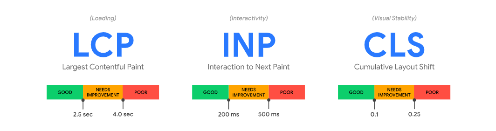

# Wydajność od strony użytkownika 
Narzędzia takie jak JMeter koncentrują się na mierzeniu czasu odpowiedzi serwera. Informacje te są bardzo ważne ale nie mierzą odczuć związanych z wyświetlaniem i stabilnością elementów strony oraz możliwości interakcji użytkownika z witryną. Różnice pomiędzy czasami raportowanymi w JMeter a tym co widzi użytkownik są duże z powodu rewolucji jaka zaszła w architekturze aplikacji web. Według danych z 2023 roku witryny web wykonują średnio 71 zapytań pobierając przy tym 2.3 Mb danych. Czas wyświetlenia strony zależy jednak nie tylko od czasu pobranie tych danych ale również od czasu wykonania kodu JavaScript przez przeglądarkę.

Od czasów wydania książki "High Performance Websites" prowadzono wiele prac mających na celu zarówno optymalizację kodu stron www jak i pomiar szybkości wyświetlania treści. Metryki Core Web Vitals stanowią ewolucję wcześniejszych prac. Pozwalają w łatwy sposób zrozumieć, jak dobrze witryna radzi sobie z szybkością, reaktywnością i stabilnością, a w konsekwencji, jak pozytywne jest doświadczenie użytkownika podczas przeglądania strony. 

## Dlaczego Core Web Vitals są ważne?

Statystyki pokazują, że strony z lepszymi wynikami Core Web Vitals mają niższy współczynnik odrzuceń i wyższy współczynnik konwersji. Badania Google wykazały, że strony osiągające docelowe wartości LCP, FID i CLS mają o 24% niższy współczynnik odrzuceń w porównaniu do stron, które nie spełniają tych kryteriów. Poprawa Core Web Vitals może więc bezpośrednio wpływać na sukces biznesowy witryny. 

Core Web Vitals stały się również jednym z kluczowych czynników rankingowych. Google wyraźnie zaznacza, że strony oferujące lepsze doświadczenie użytkownika poprzez wysokie wyniki CWV będą miały przewagę w wynikach wyszukiwania, co czyni te metryki nieodzownym elementem strategii SEO. 

Dla testerów Core Web Vitals powinny być dodatkowym elementem weryfikowanym w czasie testów, szczególnie gdy badamy wpływ obciążenia na szybkość i stabilność działania aplikacji web.

## Czym są metryki Core Web Vitals?

Core Web Vitals to zestaw trzech kluczowych metryk, które mają na celu mierzenie jakości doświadczenia użytkownika podczas przeglądania stron internetowych. Pierwszą z tych metryk jest Largest Contentful Paint (LCP), która mierzy czas potrzebny na załadowanie największego elementu widocznego w oknie przeglądarki. Mierzenie czasu do największego elementu na stronie jest kluczowe, ponieważ to właśnie ten element ma największy wpływ na postrzeganą szybkość ładowania strony przez użytkownika. Największy element zwykle zawiera najważniejsze informacje, takie jak główny obraz lub nagłówek, które są istotne dla zrozumienia zawartości strony. Im szybciej ten element jest widoczny, tym szybciej użytkownik uzyskuje dostęp do istotnych informacji, co zwiększa zadowolenie z korzystania ze strony. Elementem tym może być obraz, wideo lub duży blok tekstu. Aby zapewnić pozytywne doświadczenie użytkownika, LCP powinien wynosić poniżej 2,5 sekundy.

Dane dotyczące użycia przeglądarki Chrome pokazują, że 90% czasu spędzanego przez użytkownika na stronie przypada po jej załadowaniu. Dlatego dokładny pomiar responsywności przez cały cykl życia strony jest ważny. Właśnie to mierzy metryka Interaction to Next Paint (INP). Dokładniej INP mierzy czas, jaki upływa od momentu interakcji użytkownika z witryną (np. kliknięcia, dotknięcia ekranu) do momentu, w którym przeglądarka jest w stanie zareagować i wyświetlić następną kluczową klatkę wizualną. Pomiary dokonywane są w czasie całego pobytu użytkownika na stronie a wynik to czas najdłuższej interakcji. Dla zapewnienia pozytywnego doświadczenia użytkownika, INP powinien być jak najkrótszy, najlepiej poniżej 200 ms.

Ostatnią metryką jest Cumulative Layout Shift (CLS), która mierzy, jak często użytkownicy doświadczają niespodziewanych przesunięć elementów wizualnych na stronie. Przykładem takich przesunięć mogą być reklamy, które pojawiają się nagle i zmieniają układ strony, lub obrazy, które ładują się bez odpowiednich wymiarów. Aby zapewnić stabilność wizualną, CLS powinien wynosić poniżej 0,1.



## Jak mierzyć Core Web Vitals?

Pomiaru metryk można dokonać w środowisku testowym. Można to zrobić zarówna manualnie jak i w sposób zautomatyzowany tak aby proces pomiaru aby był częścią potoku CI/CD. 

Najprościej do pomiaru manualnego skorzystać z zakładki Performance w Chrome DevTools. Prezentuaje ona metryki dla aktualnie prezentowanej strony. Jeśli chcemy zebrać nieco więcej informacji, zasymulowąć różne warunki wyświetlania strony  a także otrzymać wskazówki co do poprawy jej wydajności należy przejść do zakładki Lighthouse i wykonać audyt strony. 

Lighthouse jest dostępny również jako samodzielna biblioteka, którą możemy wykorzystać do automatyzacji pomiarów. Narzędzie daje bardzo duże możliwości jeśli chodzi o dostosowania do własnych potrzeb ale w najproszej wersji pozwala na uruchomienie audytu poprzez wykonanie tylko 2 komend.

 
```
npm install -g lighthouse

lighthouse https://airhorner.com/
```

## Podsumowanie

Core Web Vitals są niezbędnym elementem zapewniającym wysoką jakość doświadczeń użytkownika, a ich wpływ na ranking SEO czyni je istotnym elementem każdej strategii optymalizacyjnej. Testerzy powinni regularnie monitorować i raportować wyniki CWV, korzystając z narzędzi takich jak Google Search Console, PageSpeed Insights, oraz Lighthouse, aby zapewnić maksymalną jakość i wydajność witryn internetowych.

* [Google Web Vitals Documentation](https://web.dev/articles/vitals)
* [Lighthouse](https://https://github.com/GoogleChrome/lighthouse)
* [HTTP archive reports](https://httparchive.org/reports/state-of-the-web)

