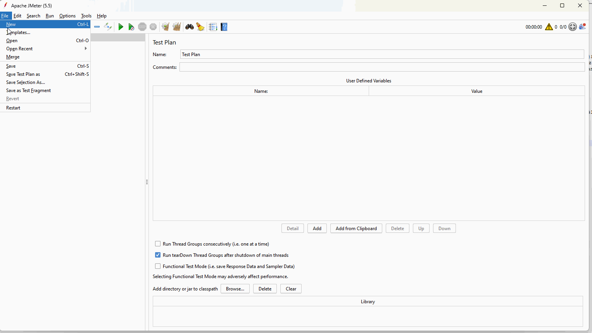

# Testowanie wydajności
Repozytorium z materiałami wykorzystywanymi na szkoleniu Testowanie Wydajności.
# Przygotowanie do szkolenia
- Pobierz i zainstaluj oprogramowanie Java SE 8 lub nowsze ze strony https://www.oracle.com/java/technologies/javase/jdk17-archive-downloads.html
- Pobierz aplikację JMeter ze strony https://jmeter.apache.org/download_jmeter.cgi. Rozpakuj archiwum do aktualnego katalogu. Po rozpakowaniu zprawdź czy aktualny katalog ma strukturę jak poniżej

```
\---apache-jmeter-5.x.y
|   \---bin
|   \---docs
|   \---extras
|   \---lib
|   \---licenses
|   \---printable_docs
```

- Sprawdź czy możesz uruchomić aplikację.

 

- Sprawdź czy możesz uruchomić rekorder skryptów (HTTP(S) Test Script Recorder) w JMeter
 
 

- Sprawdź czy po wejściu w przeglądarce na adres 
  - http://3.79.182.155/ widzisz stronę Apachu2 Ubuntu Default Page
  - http://3.79.182.155:8080/ContactsWS/ widzisz strone Corporate Contacts 
